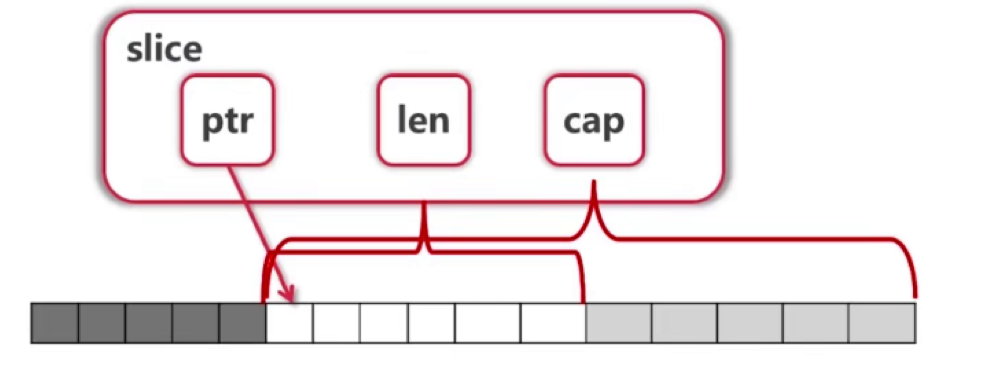
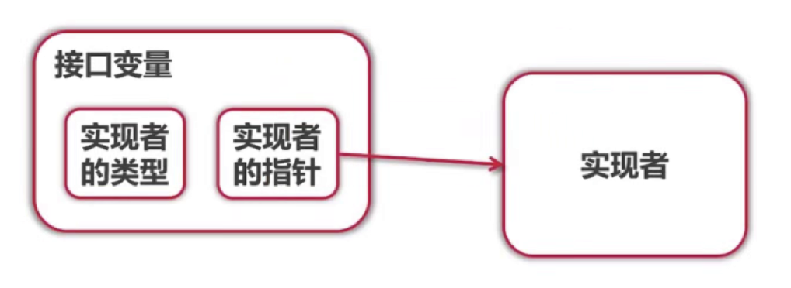

## 数组

```go
var arr1 [5]int
arr2 := [3]int{1, 2, 3}
arr3 := [...]int{1, 2, 3}  //编译器给👴自己数去
var grid [4][5]bool
```

- [10]int [20]int 是不同的类型
- 调用 func f(arr [10]int) 会 **拷贝** 数组，是值传递
- Go中一般不直接使用数组

## Slice

```go
var s []int  //空 Slice，未分配底层数组
s1 := []int{2, 4, 6, 8} //给初值，同时建立底层数组

s2 := make([]int, 16) //len cap 都是16
s3 := make([]int, 10, 32) //len=10, cap=32, 底层数组 len=32


//复制
copy(s2, s1) //copy(dst, src)

//删除
s2 = append(s2[:3], s2[4,]...) //删除 s2[3]，没有内建方法，看着有点傻，"..."表示把每个元素都喂进去
s2 = s2[1:]  //删除 s[0]
```

- Slice本身没有数据，是对底层数组的view
- 可以reSlice，怎么reSlice都共享底层数组的数据
- slice可以向后扩展，不能向前扩展
- 元素超过cap，会自动分配更大的底层数组，通常是加一倍
- append(s, val) 必须接收返回值，是值传递




## map

```go
m := make(map[string]int)
v = m[key]  ///key不存在是获得 Value 类型的初始值
v, ok := m[key]  //ok bool, 存在key否
delete(key)  //删
```

- map遍历不保证顺序，要顺序先对key排序
- map使用哈希表，key 必须可以比较相等
- 除了 slice, map, function 的内建类型都能作为key

## rune && []bytes

byte 和 rune 都只是 int 的 alias

rune 相当于go的char，存放字符的 unicode 码

```go
type byte = uint8
type rune = int32
```

```go
s := "测试test"
fmt.Println([]rune(s))  // [27979 35797 116 101 115 116]
fmt.Println([]byte(s))  // [230 181 139 232 175 149 116 101 115 116]

utf8.RuneCountInString(s) //6 获取字符的数量
utf8.RuneCount([]byte(s)) //6

//截了但没完全截
fmt.Println(s[:2])  //??
fmt.Println(s[:3])  //测

//精准截取
//先转 []rune 再转 string
s2 := []rune(s)
fmt.Println( string(s2[:1]) )
fmt.Println( string( []rune(s)[:1] ) )
```

- 对与rune，长度固定，中英文都是 [1]rune

- 对于byte，长度就不固定了，通常中文 [3]byte 英文 [1]byte

- 先转 []rune 再截取。

- 头铁可以用 []byte 截取，每次都自己数，如果不止包含中英文呢？寄


## 结构体和方法

go语言没有 class，只有 struct，struct 仅支持封装，没有继承和多态。

```go
type TreeNode struct {
  value int
  left, right *TreeNode
}

//自定义的构造函数
func NewTreeNode(v int, left *TreeNode, right *TreeNode) *TreeNode {
	return &TreeNode{
		value: v,
		left:  left,
		right: right,
	}
}

//值接收者
func (node TreeNode) Print() {
  fmt.Print(node.value)
}

//指针接收者
func (node *TreeNode) SetValue(v int) {
  node.value = v
}

//调用
node := NewTreeNode(1, nil, nil)
//node := TreeNode{value:1}
node.Print()
node.SetValue(2)
```

- 值接收者会把地址解析后copy一份数据给他
- 要改变内容必须用指针接收者
- 结构体过大也用指针接收者
- 执行性：如果有指针接收者，最好都用指针接收者
- 调用者不用区分是什么接收者，编译器会自己判断，调用方法没有区别

## 接口



[Todo]...