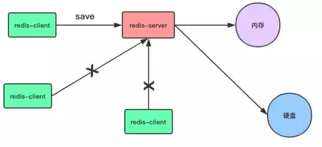
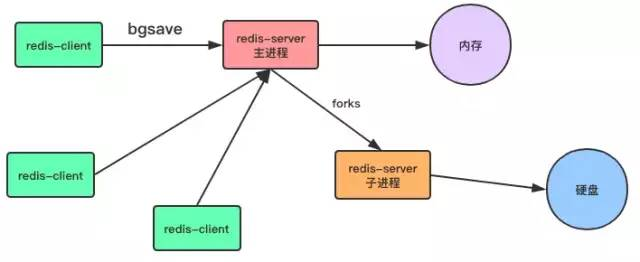
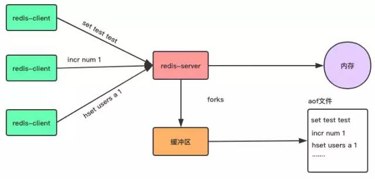
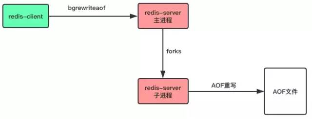
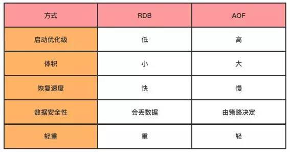

## RDB

RDB是一种快照存储持久化方式，具体就是将Redis某一时刻的内存数据保存到硬盘的文件当中，默认保存的文件名为dump.rdb，而在Redis服务器启动时，会重新加载dump.rdb文件的数据到内存当中恢复数据。

### 开启RDB持久化方式

开启RDB持久化方式很简单，客户端可以通过向Redis服务器发送save或bgsave命令让服务器生成rdb文件，或者通过服务器配置文件指定触发RDB条件。

#### 1. save命令

save命令是一个同步操作。

```
# 同步数据到磁盘上
> save
```



当客户端向服务器发送save命令请求进行持久化时，服务器会阻塞save命令之后的其他客户端的请求，直到数据同步完成。

> 如果数据量太大，同步数据会执行很久，而这期间Redis服务器也无法接收其他请求，所以，最好不要在生产环境使用`save`命令。

#### 2. bgsave

与save命令不同，bgsave命令是一个异步操作。

```
# 异步保存数据集到磁盘上
> bgsave
```



当客户端发服务发出bgsave命令时，Redis服务器主进程会forks一个子进程来数据同步问题，在将数据保存到rdb文件之后，子进程会退出。

所以，与save命令相比，Redis服务器在处理bgsave采用子线程进行IO写入，而主进程仍然可以接收其他请求，但forks子进程是同步的，所以forks子进程时，一样不能接收其他请求，这意味着，如果forks一个子进程花费的时间太久(一般是很快的)，bgsave命令仍然有阻塞其他客户的请求的情况发生。

#### 3. 服务器配置自动触发

除了通过客户端发送命令外，还有一种方式，就是在Redis配置文件中的save指定到达触发RDB持久化的条件，比如【多少秒内至少达到多少写操作】就开启RDB数据同步。

例如我们可以在配置文件redis.conf指定如下的选项：

```
# 900s内至少达到一条写命令
save 900 1
# 300s内至少达至10条写命令
save 300 10
# 60s内至少达到10000条写命令
save 60 10000
```

之后在启动服务器时加载配置文件。

```
# 启动服务器加载配置文件
redis-server redis.conf
```

这种通过服务器配置文件触发RDB的方式，与bgsave命令类似，达到触发条件时，会forks一个子进程进行数据同步，不过最好不要通过这方式来触发RDB持久化，因为设置触发的时间太短，则容易频繁写入rdb文件，影响服务器性能，时间设置太长则会造成数据丢失。

### rdb文件

前面介绍了三种让服务器生成rdb文件的方式，无论是由主进程生成还是子进程来生成，其过程如下：

1. 生成临时rdb文件，并写入数据。
2. 完成数据写入，用临时文代替代正式rdb文件。
3. 删除原来的db文件。

RDB默认生成的文件名为dump.rdb，当然，我可以通过配置文件进行更加详细配置，比如在单机下启动多个redis服务器进程时，可以通过端口号配置不同的rdb名称，如下所示：

```
# 是否压缩rdb文件
rdbcompression yes

# rdb文件的名称
dbfilename redis-6379.rdb

# rdb文件保存目录
dir ~/redis/
```

#### RDB的几个优点

1. 与AOF方式相比，通过rdb文件恢复数据比较快。
2. rdb文件非常紧凑，适合于数据备份。
3. 通过RDB进行数据备，由于使用子进程生成，所以对Redis服务器性能影响较小。

#### RDB的几个缺点

1. 如果服务器宕机的话，采用RDB的方式会造成某个时段内数据的丢失，比如我们设置10分钟同步一次或5分钟达到1000次写入就同步一次，那么如果还没达到触发条件服务器就死机了，那么这个时间段的数据会丢失。
2. 使用save命令会造成服务器阻塞，直接数据同步完成才能接收后续请求。
3. 使用bgsave命令在forks子进程时，如果数据量太大，forks的过程也会发生阻塞，另外，forks子进程会耗费内存。

## AOF

聊完了RDB，来聊聊Redis的另外一个持久化方式：AOF(Append-only file)。
与RDB存储某个时刻的快照不同，AOF持久化方式会记录客户端对服务器的每一次写操作命令，并将这些写操作以Redis协议追加保存到以后缀为aof文件末尾，在Redis服务器重启时，会加载并运行aof文件的命令，以达到恢复数据的目的。



### 开启AOF持久化方式

Redis默认不开启AOF持久化方式，我们可以在配置文件中开启并进行更加详细的配置，如下面的redis.conf文件：

```
# 开启aof机制
appendonly yes

# aof文件名
appendfilename "appendonly.aof"

# 写入策略,always表示每个写操作都保存到aof文件中,也可以是everysec或no
appendfsync always

# 默认不重写aof文件
no-appendfsync-on-rewrite no

# 保存目录
dir ~/redis/
```

### 三种写入策略

在上面的配置文件中，我们可以通过appendfsync选项指定写入策略，有三个选项。

```
appendfsync always
# appendfsync everysec
# appendfsync no
```

#### 1. always

客户端的每一个写操作都保存到aof文件当，这种策略很安全，但是每个写请注都有IO操作，所以也很慢。

#### 2. everysec

appendfsync的默认写入策略，每秒写入一次aof文件，因此，最多可能会丢失1s的数据。

#### 3. no

Redis服务器不负责写入aof，而是交由操作系统来处理什么时候写入aof文件。更快，但也是最不安全的选择，不推荐使用。

### AOF文件重写

AOF将客户端的每一个写操作都追加到aof文件末尾，比如对一个key多次执行incr命令，这时候，aof保存每一次命令到aof文件中，aof文件会变得非常大。

```
incr num 1
incr num 2
incr num 3
incr num 4
incr num 5
incr num 6
...
incr num 100000
```

aof文件太大，加载aof文件恢复数据时，就会非常慢，为了解决这个问题，Redis支持aof文件重写，通过重写aof，可以生成一个恢复当前数据的最少命令集，比如上面的例子中那么多条命令，可以重写为：

```
set num 100000
```

> aof文件是一个二进制文件，并不是像上面的例子一样，直接保存每个命令，而使用Redis自己的格式，上面只是方便演示。

#### 两种重写方式

通过在redis.conf配置文件中的选项no-appendfsync-on-rewrite可以设置是否开启重写，这种方式会在每次fsync时都重写，影响服务器性以，因此默认值为no，不推荐使用。

```
# 默认不重写aof文件
no-appendfsync-on-rewrite no
```

客户端向服务器发送bgrewriteaof命令，也可以让服务器进行AOF重写。

```
# 让服务器异步重写追加aof文件命令
> bgrewriteaof
```



#### 重写aof文件的好处

1. 压缩aof文件，减少磁盘占用量。
2. 将aof的命令压缩为最小命令集，加快了数据恢复的速度。

### AOF文件损坏

在写入aof日志文件时，如果Redis服务器宕机，则aof日志文件文件会出格式错误，在重启Redis服务器时，Redis服务器会拒绝载入这个aof文件，可以通过以下步骤修复aof并恢复数据。

1. 备份现在aof文件，以防万一。
2. 使用redis-check-aof命令修复aof文件，该命令格式如下：

```
# 修复aof日志文件
$ redis-check-aof -fix file.aof
```

1. 重启Redis服务器，加载已经修复的aof文件，恢复数据。

### AOF的优点

AOF只是追加日志文件，因此对服务器性能影响较小，速度比RDB要快，消耗的内存较少。

### AOF的缺点

1. AOF方式生成的日志文件太大，即使通过AFO重写，文件体积仍然很大。
2. 恢复数据的速度比RDB慢。

## 选择RDB还是AOF呢？

通过上面的介绍，我们了解了RDB与AOF各自的优点与缺点，到底要如何选择呢？

通过下面的表示，我们可以从几个方面对比一下RDB与AOF,在应用时，要根本自己的实际需求，选择RDB或者AOF，其实，如果想要数据足够安全，可以两种方式都开启，但两种持久化方式同时进行IO操作，会严重影响服务器性能，因此有时候不得不做出选择。



当RDB与AOF两种方式都开启时，Redis会优先使用AOF日志来恢复数据，因为AOF保存的文件比RDB文件更完整。