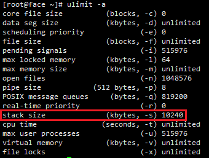

## 减少每个连接占用的内存

linux操作系统默认每个连接数占用10M内存。

使用ulimit -a 查看stack size，即为每个连接数占用的内存。



 所有连接数消耗的内存加起来相当惊人，推荐把Stack设置小一点，比如说1024：在linux命令窗口输入*ulimit -s 1024*。这种方式的缺点是，重新打开一个shell命令窗口就失效啦，需要重新执行这一条命令。

永久生效的方式，修改/etc/profile，在最后添加*ulimit -s 1024*，然后保存并*source /etc/profile*

## 增加文件描述符数

Linux默认的文件描述符数和最大进程数对于高并发系统来说一般会太低。建议把这个数值设为100000以上。如果这个数字太小的话在大规模并发操作情况下可能会出错或无法响应。报以下错误信息：

```
"too many open files"
"too many open connections"
```

上面报错的信息，说明打开的连接数太多了，操作系统的ulimit限制，可以用*ulimit -a*查看open files，是否够大。linux下默认的open files是1024，在提供服务的时候往往太小。

可以通过以下命令来修改这些值，暂时性，重新打开shell命令窗口会失效：

```
ulimit -n 1048576
ulimit -u 524288
```

这时可以通过修改/etc/security/limits.conf（ 部分的系统是在/etc/security/limits.d/90-nproc.conf）持久化设置允许用户/进程打开文件句柄数，这一步需要重启系统，不然不起作用，在limits.conf添加如下设置：

```
* soft nofile 1048576
* hard nofile 1048576
* soft nproc 524288
* hard nproc 524288
```