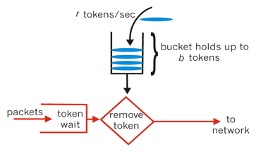

# 限流算法：漏桶算法&令牌桶算法

## 漏桶算法

把请求比作是水，水来了都先放进桶里，并以限定的速度出水，当水来得过猛而出水不够快时就会导致水直接溢出，即拒绝服务。

漏斗有一个进水口 和 一个出水口，出水口以一定速率出水，并且有一个最大出水速率：

在漏斗中没有水的时候，

- 如果进水速率小于等于最大出水速率，那么，出水速率等于进水速率，此时，不会积水
- 如果进水速率大于最大出水速率，那么，漏斗以最大速率出水，此时，多余的水会积在漏斗中

在漏斗中有水的时候

- 出水口以最大速率出水
- 如果漏斗未满，且有进水的话，那么这些水会积在漏斗中
- 如果漏斗已满，且有进水的话，那么这些水会溢出到漏斗之外

## 令牌桶算法

对于很多应用场景来说，除了要求能够限制数据的平均传输速率外，还要求允许某种程度的突发传输。这时候漏桶算法可能就不合适了，令牌桶算法更为适合。

令牌桶算法的原理是系统以恒定的速率产生令牌，然后把令牌放到令牌桶中，令牌桶有一个容量，当令牌桶满了的时候，再向其中放令牌，那么多余的令牌会被丢弃；当想要处理一个请求的时候，需要从令牌桶中取出一个令牌，如果此时令牌桶中没有令牌，那么则拒绝该请求。

## 令牌桶算法VS漏桶算法

**漏桶**

漏桶的出水速度是恒定的，那么意味着如果瞬时大流量的话，将有大部分请求被丢弃掉（也就是所谓的溢出）。

**令牌桶**

生成令牌的速度是恒定的，而请求去拿令牌是没有速度限制的。这意味，面对瞬时大流量，该算法可以在短时间内请求拿到大量令牌，而且拿令牌的过程并不是消耗很大的事情。